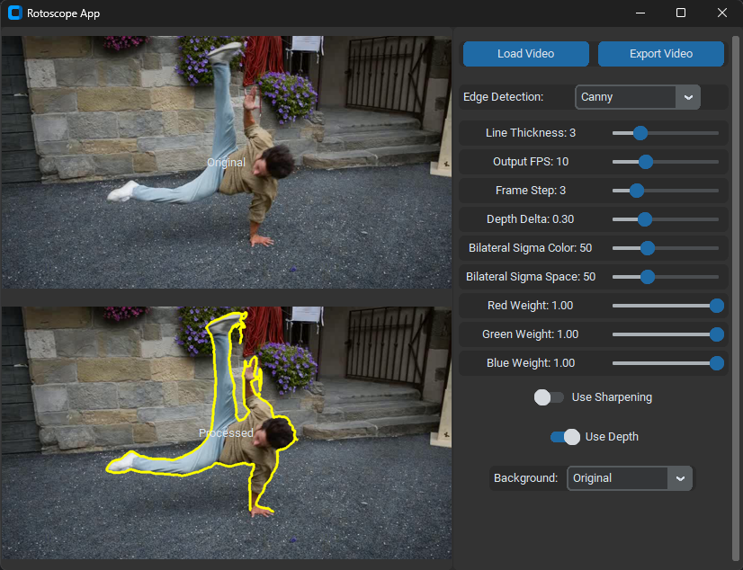

# Rotoscoping App

A GUI application for creating rotoscope-style animations from videos using edge detection.

## Preview




## Features

- **Multiple Processing Modes**:
  - Classic edge detection (Canny/Scharr)
  - Depth-based edge detection (using Depth-Anything V2 model)
- **Enhanced Controls**:
  - Adjustable line thickness (1-10px)
  - Frame stepping (process every 1-10 frames)
  - Output FPS control (1-30 FPS)
  - RGB channel weighting for color-sensitive edges
- **Background Options**:
  - Original video background
  - Black background
  - Depth map visualization
- **Real-time preview** of processing results
- **Export to MP4** with customizable settings


## Getting Started

### For Users
Pre-built executables are available in the [Releases section](https://github.com/yourusername/rotoscope-app/releases) for easy use without Python installation.

### For Developers
1. Clone this repository
2. Install requirements:
   ```
   pip install opencv-python customtkinter pillow numpy
   ```
3. Run the app:
   ```
   python rotoscope_app.py
   ```

## Settings Reference

| Setting               | Description                                      |
| --------------------- | ------------------------------------------------ |
| Line Thickness        | Contour line width in pixels                     |
| Output FPS            | Frame rate of exported video                     |
| Frame Step            | How often frames are processed (1 = every frame) |
| Bilateral Sigma Color | Color sensitivity of the bilateral filter        |
| Bilateral Sigma Space | Spatial extent of bilateral filtering            |
| Use Canny             | Toggle between Canny and Scharr edge detectors   |
| Overlay on Original   | Draw contours over original video or blank       |
| Use Sharpening        | Apply sharpening before detection                |
| RGB Channel Weights   | Per-channel edge strength tuning                 |
| Use Sharpening        | Apply sharpening before edge detection           |
| Use Depth             | Enable depth-based processing                    |

## How to Use

1. Click "Load Video" to select your input video
2. Adjust the settings to get your desired effect
3. Click "Export Video" to save the processed version

## Tips
- Use Frame Step values of 2-3 to achieve the classic "animated on 2s or 3s" look 
- Higher bilateral filter values create softer edges

## About

This is a hobby project created for fun. The application provides an easy way to experiment with video processing and edge detection techniques.

For those who don't want to install Python, pre-built Windows executables are available in the Releases section. The source code is provided for those who want to modify or extend the functionality.

*Example output using depth estimation (image adapted from [MegaSaM](https://mega-sam.github.io/index.html) paper, credit to original authors)*
